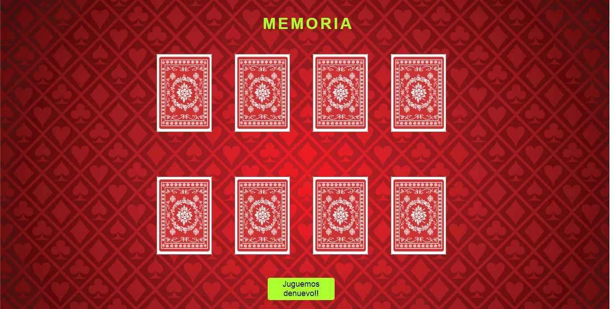

# Memoria 

## Resultado

##  Descripción

Aplicacion web de juego de memoria entre cartas con numeros y palos aleatorios.

## Requisitos

- Utilizar React
- Mostrar 8 cartas sobre la mesa.
- Las cartas siempre tienen pareja, ningun queda sola.
- Las cartas cargan aleatoriamente, tanto el tipo y número como el orden sobre la mesa.
- Si encontramos un par, las cartas desaparecerán en su mismo sitio sin moverse las demás.
- Solo son pares las cartas del mismo número y tipo/palo.
- Si se encontraron todos los pares mostrar un mensaje de juego terminado.

## Jugar

- Ingresa al [link del juego](https://laurajimenezh.github.io/Memory-reto/).
- Elige las cartas y encuentra su pareja.
- Una vez lo hayas logrado puedes darle click al boton Jugar denuevo!! y volver a jugar.

## Autora

- Laura Jimenez
